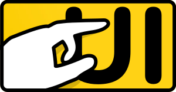

# PokeAtUI - Simple in-browser UI test automation

This is a test framework intended for automating UI testing in web browsers
using methods that are a close match to the end user's perspective rather
than developer's own.

**This code is work in progress. It's not yet production-ready. It's a PET
PROJECT. You have been warned.**

## Why?

I wanted a test runner that:

- Has no dependencies
- Does not require me to install a package
- Runs in the actual browser and tests the page as rendered by the browser
- Can simulate user interactions at a high level
- Does not require "programming" the tests; minimize moving parts, make all
  calls more or less declarative
- Can run against different environments and browsers without too much (any?) 
  messing around, preferably on an actual computer/phone
- Can see the UI updating live as the tests run
- Does *not* run tests in parallel; this has been giving me headaches in
  most test runners so I'd rather that my tests run completely isolated of
  each other at the cost of longer run time

I also just wanted to write one and see where it will go. This is not
intended to be the "next big thing" in UI testing. It's just my pet project.

## Example

You will find an example of the tests written for the 
[Vanilla TODO](https://github.com/foxbunny/vanilla-todo) demo project. The live
version of the tests can be found 
[here](https://foxbunny.github.io/vanilla-todo/tests.html).

Excerpt from the tests:

```javascript
{
  'use strict'

  let { testDocument } = window.PokeAtUI

  testDocument('index.html')
    .useCase('Default UI', (ui, done) => {
      ui.countElementsWithLabel('button', 'Add task', 1)
      ui.noElementsMatch('form field', 'Task')
      ui.noElementsMatch('button', 'Clear completed')
      done()
    })
    .useCase('Add new task', (ui, done) => {
      ui.clickElement('button', 'Add task')
      ui.countElementsWithLabel('button', 'Clear completed', 1)
      ui.countElementsWithLabel('form field', 'Task', 1)
      ui.shouldHaveFocus('form field', 'Task')
      done()
    })
    .useCase('Edit task text', (ui, done) => {
      ui.clickElement('button', 'Add task')
      ui.typeIntoFocusedField('My new task', thenCheckField)
      function thenCheckField() {
        ui.fieldShouldHaveValue('Task', 'My new task')
        done()
      }
    })
    // ...
    .run()
}
```

## Roadmap

- [x] Basic test organization and runner
- [x] Support async test code execution
- [x] Basic user interaction methods (clicking, typing, pasting text)
- [x] Basic UI assertions (form value, presence/absence of elements)
- [x] Add auto-scroll to drag & drop action
- [ ] Allow interaction with label-less elements
- [ ] Add support for performing actions based on coordinates (e.g., clicking)
- [ ] Handle elements that are visually hidden or have `pointer-events: none`
- [x] Touch support
- [ ] Touch gesture support (pinch, twist, swipe)
- [ ] Mocking HTTP
- [ ] Storage fixtures
- [ ] Ability to transition between pages
- [ ] (OPTIONAL) Support for headless environment (e.g., in CI)

## Installing

Create a separate HTML file for hosting your test page. The test page will
be inserted into the host page via the script. Link the script using the
standard script tag.

```html
<!doctype html>
<html lang="en">
  <head>
    <title>Test host</title>
    <!-- ... -->
    <script defer src="pokeatui.js"></script>
    <script defer src="my-test.js"></script>
  </head>
  <body><!-- You want this to be blank. --></body>
</html>
```

`my-test.js` is the test script.

If you insist on using this as a package, make one yourself, publish it
wherever you wish, and remember that `pokeatui.js` is a CommonJS-compatible
module. However, you really don't have to do that.

## Usage inside CI

Since part of the design was to keep both the test code and the test library
code simple, CI integration was not considered. CI is by itself very
complex business, and anything it touches becomes quite a bit more complex.
Having said that, CI integration is somewhere at the back of my mind,
waiting for a big bright idea.

## Initializing the test page

To initialize the test page, we call the PokeAtUI's `testPage()` function.

```javascript
// my-test.js
{
  let { testPage } = window.PokeAtUI

  testPage('index.html')
}
```

Nothing happens yet. What we get from this call is an object that we use to
set up our tests and run them. Let's focus on the function call for the
moment, though.

### Test page URL

The first argument is the URL. Usually this is a path to the application 
HTML. You can deploy tests to the same server and run the tests in any  
environment.

If you [disable cross origin checks](https://stackoverflow.com/questions/3102819/disable-same-origin-policy-in-chrome) 
in your browser, you point the function to any URL, like, say, the dev server's 
URL.

```javascript
// my-test.js
{
  let { testPage } = window.PokeAtUI

  testPage('http://localhost:8000/')
}
```

You can even test a live page at a production URL:

```javascript
// my-test.js
{
  let { testPage } = window.PokeAtUI

  testPage('https://example.com/')
}
```

In a more convoluted example, you can switch the URL based on the
environment passed via a query string parameter:

```javascript
// my-test.js
{
  let
    { testPage } = window.PokeAtUI,
    TEST_URLS = {
      local: 'index.html',
      dev: 'https://dev.coolservice.io/',
      prod: 'https://coolservice.io/',
    },
    env = new URLSearchParams(location.search).get('env') || 'local'

  testPage(TEST_URLS[env])
}
```

If you open your `test.html` with the appropriate query string parameter,
like `test.html?env=dev`, the test loads the appropriate URL based on the
configuration specified in `TEST_URLS`.

### Test runner options

You can pass a second argument that represents the runner options. For example:

```javascript
// my-test.js
{
  let { testPage } = window.PokeAtUI

  testPage('index.html', { width: 1024, height: 768 })
}
```

The following options are available:

- `width` and `height` - iframe dimensions; we use fixed dimensions so that
  we can rely on the page layout being the same across test runs. You should
  make sure that the iframe fits entire in the viewport when running the
  tests, though, as some test operations relies on the entirety of the frame
  being within the viewport. (Default: `800`, `600`)
- `clearStorageBetweenTests` - clears the storage (`localStorage`) between
  individual use cases. Completely separately from this, the storage is
  cleared once before the test suite runs, and restored once the page is closed.
  (Default: `true`)
- `minTypingDelay` - minimum interval in ms between two keystrokes when
  simulating typing on the keyboard. This interval is further extended by a
  jitter of 0 to 50ms. (Default: `50`)
- `testTimeout` - period in ms after which the test is considered as taking too
  long and failed automatically. Even if the test code reports success past
  this point, it will be ignored. (Default: `8000`)

## Specifying the use cases

Tests are organized into use cases. These should (ideally) directly
correspond to the requirements against you are writing the application. But
even if there aren't any (e.g., it's your pet project, or your organization
doesn't care about such formalities), you can still go off reasonable
scenarios that your users will follow. For example:

```javascript
// my-test.js
{
  let { testPage } = window.PokeAtUI

  testPage('index.html')
    .useCase('Sign up', (ui, done) => {

    })
    .useCase('Create a post', (ui, done) => {

    })
    .useCase('Edit a post', (ui, done) => {

    })
}
```

Each use case consists of a title and a callback. The title is the first
argument passed to the `.useCase()` method. The second argument is the
callback or the 'test code' as it's called internally. The test code takes
two arguments, the UI tools and the `done` callback. The callback must be
called to announce the end of the test.

We'll discuss the UI tools in a separate section.

## Running the cases

Finally, to run all use cases, simply call the `.run()` method after all the
`.useCase()` methods.

```javascript
// my-test.js
{
  let { testPage } = window.PokeAtUI

  testPage('index.html')
    .useCase('Sign up', (ui, done) => {

    })
    // ....
    .run()
}
```

The test progress and reports are displayed in the console.

## UI tools

The first argument that each use case callback receives is an object with
methods for performing various actions and making assertions.

The following methods are available:

### Page actions

#### `refresh(cb)`

Refreshes the page by calling `location.reload()` *within* the iframe. It
takes a callback as its only argument, and this callback is invoked when the
iframe contents reload.

This is useful for testing things like state persistence across reload, etc.

Example:

```javascript
testPage('index.html')
  .useCase('Title persists after refresh', (ui, done) => {
    ui.clickElement('form field', 'Title')
    ui.typeIntoFocusedField('Temporary title', thenRefresh)
    function thenRefresh() {
      ui.refresh(thenCnfirm)
    }
    function thenConfirm() {
      ui.fieldShouldHaveValue('Title', 'Temporary title')
      done()
    }
  })
```

#### `scrollToTop()`

Scroll the page to top. This method is synchronous and does not require a 
callback. Scrolling is instant.

Example:

```javascript
testPage('index.html')
  .useCase('Scroll to top', (ui, done) => {
    ui.clickElement('button', 'Add task')
    ui.scrollToTop()
    // ...
  })
```

### Mouse / pointer device actions

#### `clickElement(elementType, label, position = 1)`

Simulates a click on the element identified by its type and label. The
element type is an abstract concept not directly correlated to the tag name.
(See the Element type and Label sections.) The `position` argument is used 
to specify which of the multiple matching elements should receive the click.

Clicking a focusable element will focus it just like the browser would normally.

If there is any focused element, calling this method on a different element
will cause the focused element to be blurred. If the element is a form field
and its value was previous modified, a `change` event will also be emitted
on it.

Note that this does not send out the cursor position so the event object
will not have `screenX`, `screenY` and similar properties.

Example:

```javascript
testPage('index.html')
  .useCase('Close the modal', (ui, done) => {
    ui.clickElement('button', 'Menu')
    ui.clickElement('button', 'Close')
    done()
  })
```

#### `grabElementAtPoint(x, y)`

Click and hold an element under the specified coordinates. These coordinates
are based on the iframe (`0, 0` means top-left corner of the iframe, not
the viewport), and appropriate coordinates are sent out in the emitted
events, including `screenX`, `screenY` and similar.

If the element being clicked is a `draggable`, then a `dragstart` event is
also emitted.

This method will throw an exception if an element has already been grabbed
previously.

Example:

```javascript
testPage('index.html')
  .useCase('Move to trash', (ui, done) => {
    ui.grabElementAtPoint(200, 463)
    done()
  })
```

#### `dragGrabbedElementBy(distX, distY, cb)`

If an element has been grabbed using `grabElementAtPoint()`, this method
will drag it by `distX` and `distY` pixels along the x and y axes, respectively.
A fake cursor is drawn over the page while the drag is being simulated to
visualize the motion. Appropriate events are triggered on elements below the
cursor while it moves. If the grabbed element has a `draggable` attribute, the
`dragover` event is also triggered on elements under the simulated cursor.

The third argument is a callback that is invoked once the motion is completed.

This method will throw an exception if an element has not been grabbed
previously.

Example:

```javascript
testPage('index.html')
  .useCase('Move to trash', (ui, done) => {
    ui.grabElementAtPoint(200, 463)
    ui.dragGrabbedElementBy(-20, 304, done)
  })
```

#### `dropGrabbedElement()`

If an element has been grabbed by `grabElementAtPoint()`, this method
simulates releasing the element. If the grabbed element has a `draggable`
attribute, this action will also emit a `dragend` event.

This method will throw an exception if an element has not been grabbed
previously.

Example:

```javascript
testPage('index.html')
  .useCase('Move to trash', (ui, done) => {
    ui.grabElementAtPoint(200, 463)
    ui.dragGrabbedElementBy(-20, 304, thenDrop)
    function thenDrop() { 
      ui.dropGrabbedElement()
      done()
    }
  })
```

### Keyboard actions

#### `typeIntoFocusedField(text, cb)`

Types the specified text into the currently focused field. Note that this
action only checks whether there is a focused element, but not whether the
element can actually be typed into. This method simulates an actual person
typing into the input. It will separately emit keyboard events for every
stage of every keystroke, and also a separate `input` event for each
keystroke as well.

When the typing is finished, the callback is invoked.

This method will throw an exception if there are no focused elements.

Example:

```javascript
testPage('index.html')
  .useCase('Enter the name', (ui, done) => {
    ui.clickElement('form field', 'Name')
    ui.typeIntoFocusedField('John Doe', done)
  })
```

#### `pasteIntoFocusedField(text)`

Simulates pasting text into a text field. This method simulates the user 
using a keyboard shortcut to paste text into a text field. It triggers a 
Ctrl+V shortcut and then inserts the text into the field. An `input` event 
is triggered once the field value is modified.

Unlike `typeIntoFocusedField()`, this method is synchronous and finishes 
near-instantly.

Example:

```javascript
testPage('index.html')
  .useCase('Paste the name', (ui, done) => {
    ui.clickElement('form field', 'Name')
    ui.pasteIntoFocusedField('John Doe')
    done()
  })
```

### Making assertions about the UI

#### `noElementsMatch(elementType, label)`

Checks that no element matches the type-label combination. Throws an exception
if at least one element matches. (See Element types and Labels sections.)

Example:

```javascript
testPage('index.html')
  .useCase('Delete multiple nodes', (ui, done) => {
    ui.clickElement('button', 'Add a node')
    ui.clickElement('button', 'Add a node')
    ui.clickElement('button', 'Delete node')
    ui.clickElement('button', 'Delete node')
    ui.noElementsMatch('button', 'Delete node')
    done()
  })
```

#### `countMatchingElements(elementType, label, count)`

Checks that there are exactly `count` elements that match the type-label 
combination. Throws if there are less or more matching elements. (See 
Element types and Labels sections.)

This method cannot use `0` as the count. To check that there are no elements,
use the `noElementsMatch()` method instead. This is done to improve the 
clarity of the intent as well as to keep the code simpler under the hood.

Example:

```javascript
testPage('index.html')
  .useCase('Add multiple nodes', (ui, done) => {
    ui.clickElement('button', 'Add a node')
    ui.clickElement('button', 'Add a node')
    ui.countMatchingElements('button', 'Delete node', 2)
    done()
  })
```

#### `shouldHaveFocus(elementType, label, position = 1)`

Checks that an element matching element type and label has focus. The third 
argument, `position`, is used to specify which of the multiple matches we 
are targeting.

If no element has focus, this method will throw an exception.

Example:

```javascript
testPage('index.html')
  .useCase('Add a new node', (ui, done) => {
    ui.clickElement('button', 'Add a node')
    ui.shouldHaveFocus('form field', 'Node name')
    done()
  })
```

#### `fieldShouldHaveValue(label, value, position = 1)`

Checks a form field's value. This method will look up a form field with the 
specified label and throw an exception if the value does not match. The 
third argument, `position`, is used to specify which of the multiple matches 
we are targeting. The value matches with strict equality and case-sensitively.

For checkboxes and radio buttons the value is associated with the state of 
those controls:

- `'unchecked'` - checkbox/radio is not checked
- `'checked'` - checkbox/radio is checked
- `'indeterminate'` - checkbox is [indeterminate](https://developer.mozilla.org/en-US/docs/Web/HTML/Element/input/checkbox#indeterminate_state_checkboxes)

Example:

```javascript
testPage('index.html')
  .useCase('Edit node text', (ui, done) => {
    ui.clickElement('button', 'Add a node')
    ui.fieldShouldHaveValue('Position', '1')
    ui.fieldShouldHaveValue('Deleted', 'unchecked')
    done()
  })
```

## Notes

Here are some notes about the concepts used in PokeAtUI.

### Event simulation

Since PokeAtUI is a JavaScript script, it is subject to the same limitations 
as any application. It cannot move the mouse, it cannot trigger things that 
your application cannot trigger (e.g., trigger keyboard navigation), and so 
on. The actions triggered by the test code are therefore not going to match 
the real browser behavior 100%. While some effort has been invested into 
making PokeAtUI reasonably accurate, it's goal is not a faithful 
reproduction of the real browser behavior. Rather, it aims to be accurate 
enough to facilitate UI testing for most apps.

Apps that will not be testable with PokeAtUI are apps that use various hacks.
For example, if your app relies on the fact that preventing the default 
behavior in `pointerdown` will prevent the `click` event but not `pointerup`,
you will not be able to test using PokeAtUI as this library has a simplified 
handling of default prevention that will cause `pointerup` to also be 
prevented. However, if you are suppressing `mousedown` by preventing the 
default in `touchstart`, which is a common practice to support both 
touch and mouse, PokeAtUI will be able to replicate this.

### Element types

The following element types are supported by PokeAtUI:

- **button** - either an actual `<button>` element or any element with
  `role="button"` attribute.
- **form field** - inputs, select lists, textareas

### Labels

The label is a readable text that is associated with the element. This can be a
partial match (the specified label ony needs to be contained in the on-screen
label) but it's always case-sensitive. In the form fields' case, the label is
either the text content of a `<label>` element whose `for` attribute points to
the input, or the text content of a `<label>` element that encloses the input.

Only elements that do not have the `hidden` attribute are selectable, but the
elements that are just visually hidden are still selectable.

Visually hidden labels are also considered when testing the label text.

## License

This code is licensed under the terms of the MIT license. See 
[LICENSE.txt](LICENSE.txt) for the boring legal verbiage.
